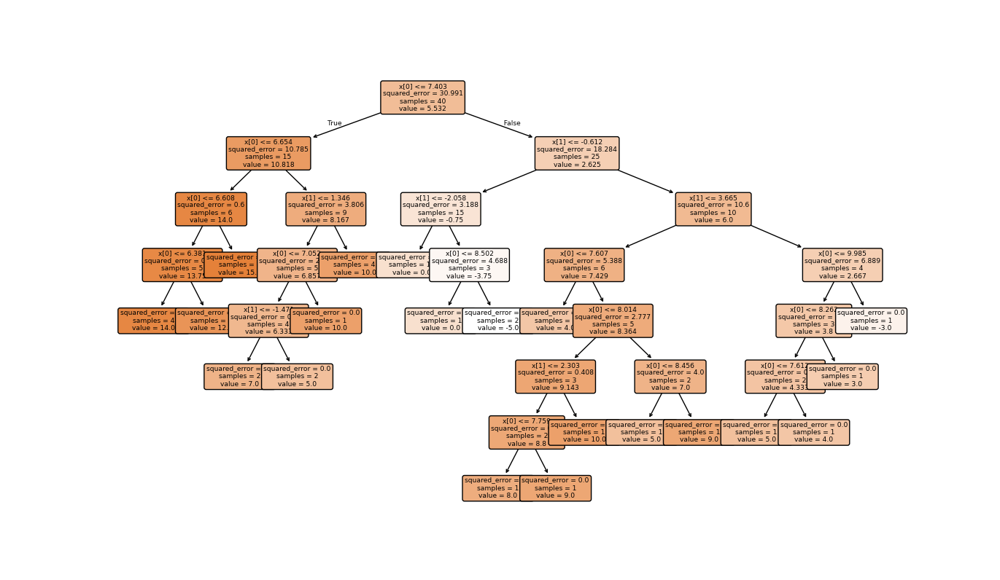
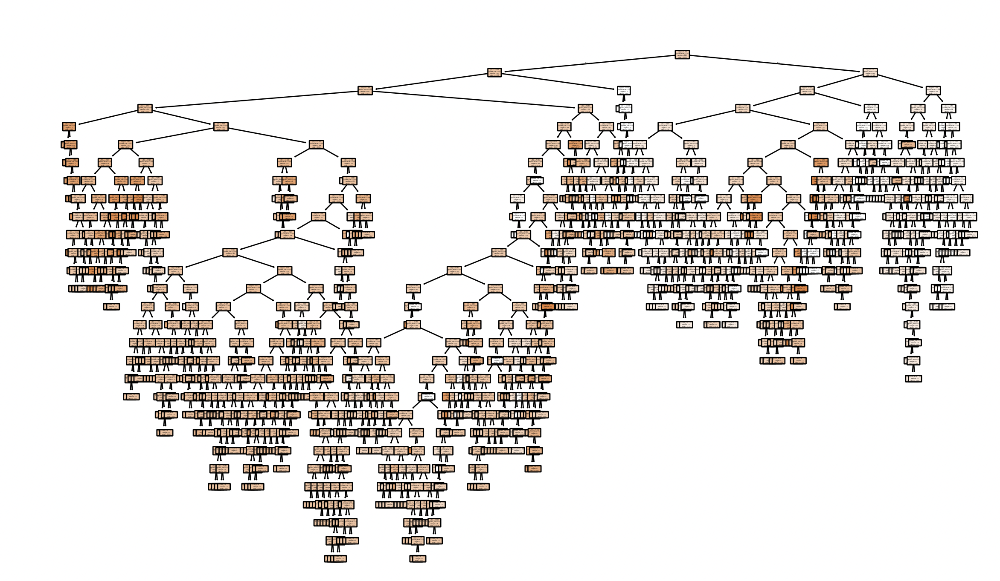
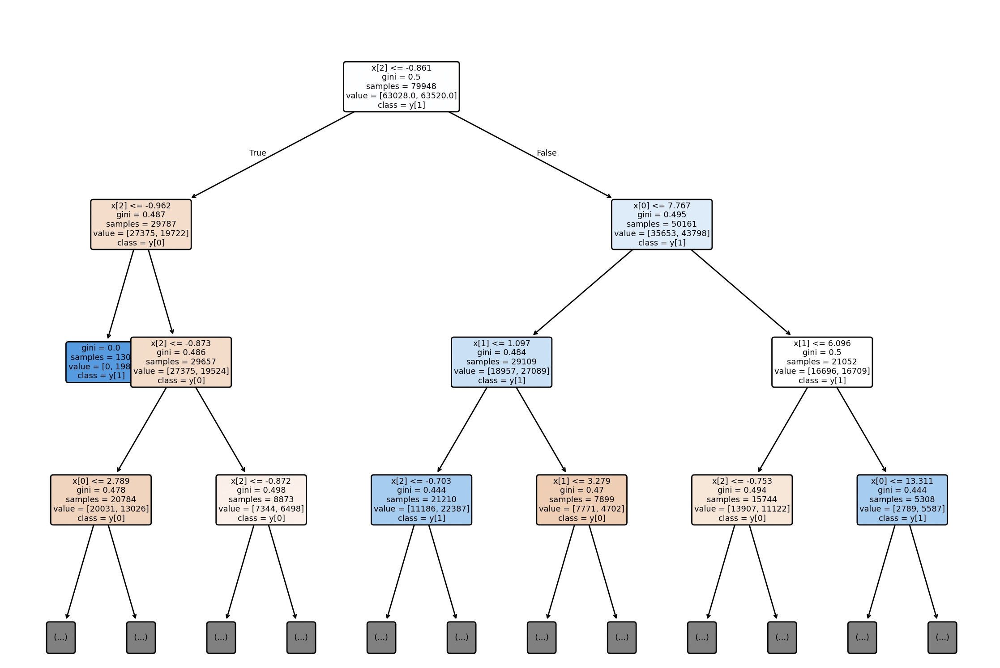
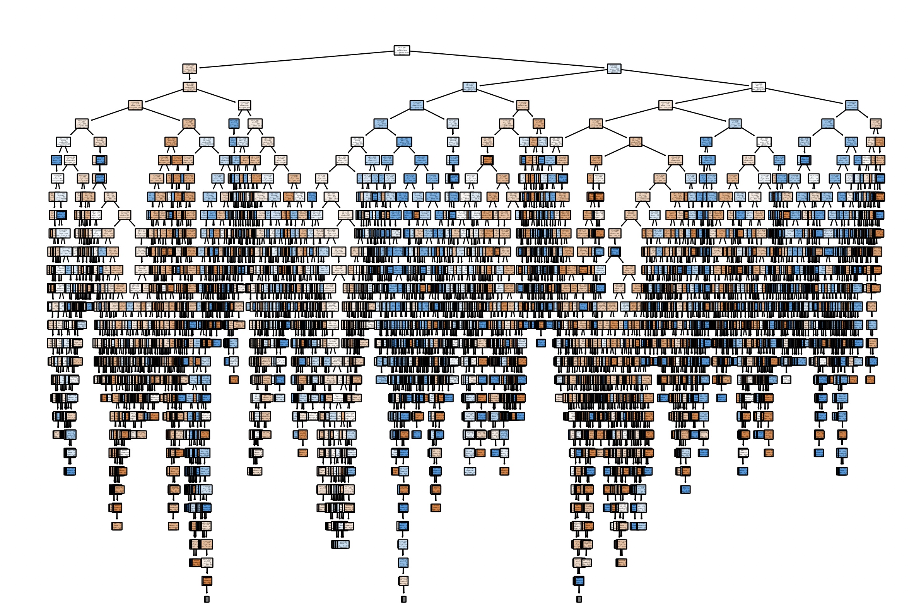
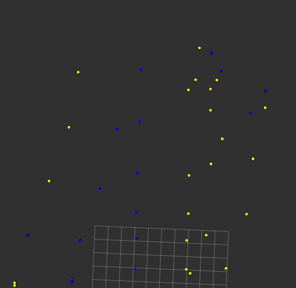
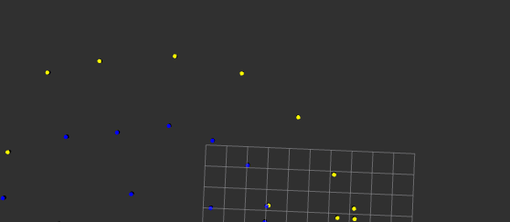
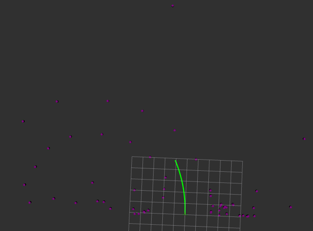
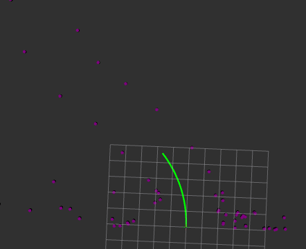

# RandomForest_based_PathPlannar-ObjectDetection

In the following solution, the project provides two solutions for formula student object detection and path planning. Both solutions are based on the scikit random forest regression solution.

## Why it is good: 

``Unlike neural network based solutions, it runs very well on processors.
It is very easy to learn. 
It is fast and efficient. 
Difficult to over-learn models. ``

## How to use:
If you have the topics you need for this nodes, just start it and it does everything by itself. The data collection part is left running until the fault, so if you want to start teaching the model press f then enter and it will start teaching. The code will then indicate when the model is ready. It is important to note that the data collection will continue during this time, so if you teach a model at different times, you will get models of different "strengths".  

## Solutions: 
``path_planner_trainer:``
Trains the model to "drive" using the steering angle and clustered lidar point cloud.

``path_planner_rf:``
Runs the driver model in realtime scans the clustered point cloud and publishes the planned path. 

``object_detection_trainer:``
Reads in the deprojected and fused data of the objects detected by the yolov8 model from the camera image and the clustered point cloud data separately to the lidar and trains a model that can determine the colors based only on the clustered point cloud.

``object_detector:``
Reads the clustered pointcloud and runs the model in realtime. And as output, it publishes the colored point clouds. 

# Internal structure of models: 
## turn_angle_model:

8 level of a modell

full review

## marker_classification_model05:

4 level of a modell

full review

## Output:

Cones with color

Cones with color

Planned trajectory

Planned trajectory

# Overview: 
Depending on the input data, models can achieve high accuracy at high processing speeds. It is important that the model receives stable inputs with sufficient reliability during training, so the automatic learning what is in this example may not be the best solution. 
By changing the inputs, there are several applications, for example f1tenth.

By Balázs Szőnyi 2024.11.01. Széchenyi István University