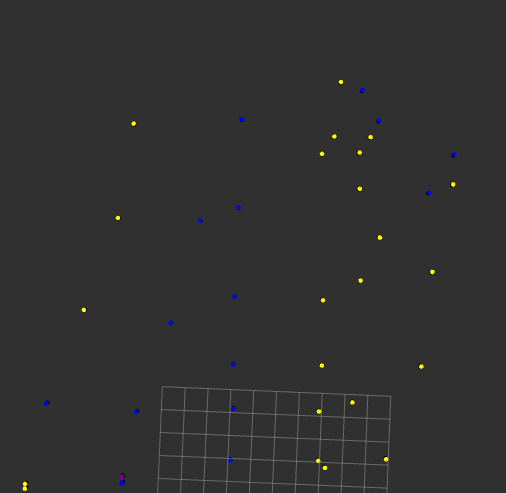
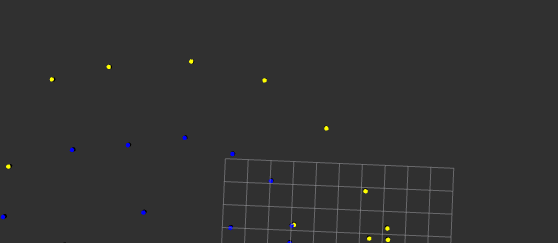

# Path_planner_trainer
This solution is able to learn which point in the clustered point cloud is likely to be a cone based on the cone data read from the lidar or camera.




Structure of the trained modell 
## Prerequisites

- ROS2 (Foxy or later)
- Python 3.x
- Required packages: `numpy`, `joblib`, `threading`, `sklearn`, `pandas`, `math`

## Build


```bash
colcon build --symlink-install --packages-select object_detector
```

## Run

After building the package, source your ROS2 workspace:

```bash
source ~/ros2_ws/install/setup.bash
```

Then, run the trainer node:

```bash
ros2 run object_detector object_detector_node                      
```

## Input file:
`marker_classification_model05.pkl`

## Output topics: 

Points with color: `pc_markers_with_colors` in Markerarray format


