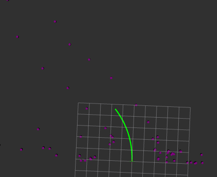

# Path_planner_rf




## Prerequisites

- ROS2 (Foxy or later)
- Python 3.x
- Required packages: `numpy`, `joblib`, 

## Build


```bash
colcon build --symlink-install --packages-select path_planner_rf
```

## Run

After building the package, source your ROS2 workspace:

```bash
source ~/ros2_ws/install/setup.bash
```

Then, run the layout generator node:

```bash
ros2 run active_filter path_planner_rf                      
```

## Inputs:

Clastered and prefiltered pointcloud points:`pc_markers`, ``

## Output topics: 

Planned path: `spline_marker` in Marker format
Left side of the track:`left_markers` in Markerarray format
Right side of the track:`right_markers` in Markerarray format


