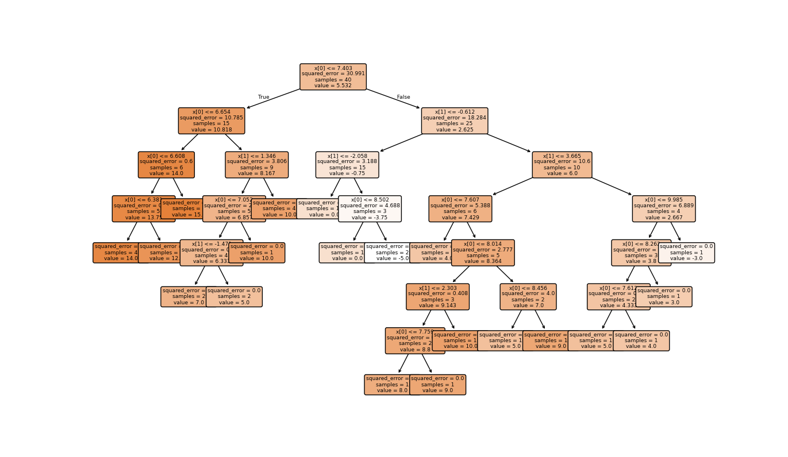
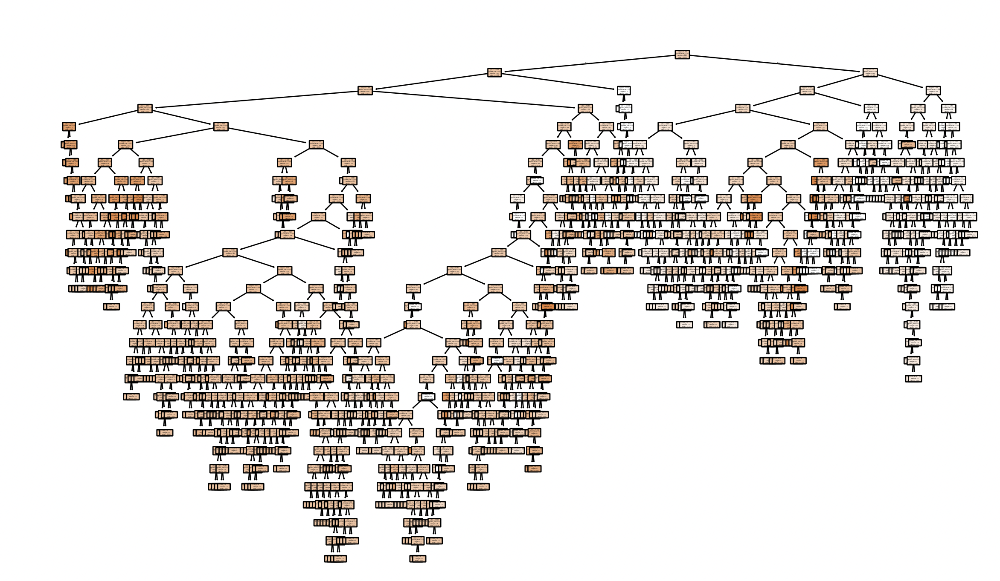

# Path_planner_trainer
This solution can learn the relationship between the steering angle and the clustered point cloud and plot a steering angle or path based on this and define the two edges of the path and mark them in blue and yellow respectively. 



Structure of the trained modell 
## Prerequisites

- ROS2 (Foxy or later)
- Python 3.x
- Required packages: `numpy`, `joblib`, `threading`, `sklearn`, `pandas`

## Build


```bash
colcon build --symlink-install --packages-select path_planner_trainer
```

## Run

After building the package, source your ROS2 workspace:

```bash
source ~/ros2_ws/install/setup.bash
```

Then, run the trainer node:

```bash
ros2 run active_filter active_filter_node                      
```

## OUTPUT FILES

`marker_data.csv`, `turn_angle_model.pkl`

# If u want to export modell, clcik to terminal window press the f button and then ENTER when the code runing!

